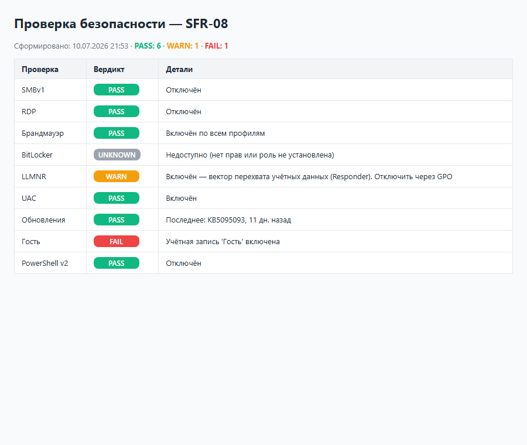
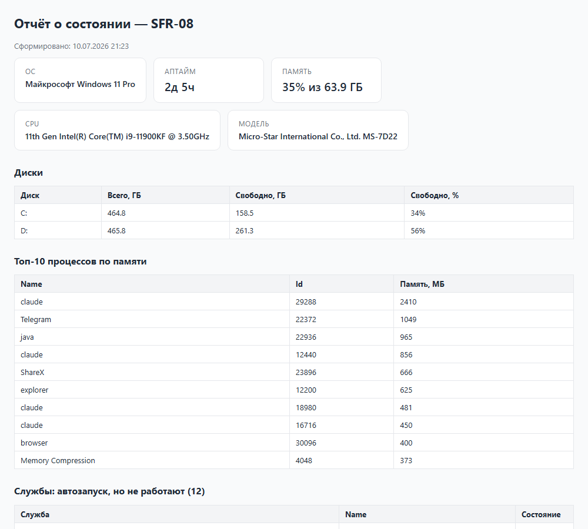

# 🧰 PowerShell Toolbox

Рабочие PowerShell-скрипты системного администратора — из реальной практики
(инвентаризация сети, аудит Active Directory, миграция на NAS, отчёты о состоянии
серверов), причёсанные и обезличенные для публикации.

Всё совместимо с **Windows PowerShell 5.1** — работает на любой живой Windows
без установки чего-либо.

## 📋 Отчёты

Некоторые скрипты формируют самодостаточные HTML-отчёты (без внешних зависимостей —
открываются где угодно, отправляются почтой).

`Test-SecurityBaseline.ps1` — чеклист безопасности машины:



`New-ServerHealthReport.ps1` — состояние сервера:



## Скрипты

### Active Directory
| Скрипт | Что делает |
|---|---|
| [Invoke-ADAudit.ps1](Invoke-ADAudit.ps1) | ⭐ Аудит здоровья домена одним запуском → HTML: неактивные учётки, пароли «без срока», лишние админы, заблокированные и просроченные записи, мёртвые компьютеры. Только чтение |
| [Send-PasswordExpiryReminder.ps1](Send-PasswordExpiryReminder.ps1) | Напоминание о скором истечении пароля AD в Telegram. На планировщик — и пользователи меняют пароль заранее |
| [New-BulkADUsers.ps1](New-BulkADUsers.ps1) | Массовое создание пользователей AD из CSV + структура OU. Пример данных: [users.sample.csv](users.sample.csv) |

### Инвентаризация и отчёты
| Скрипт | Что делает |
|---|---|
| [Get-FleetHealth.ps1](Get-FleetHealth.ps1) | ⭐ Здоровье всего парка серверов одной таблицей: берёт список из AD, обходит по сети, подсвечивает где мало места / память на пределе / давно не перезагружался / упали службы |
| [Scan-Network.ps1](Scan-Network.ps1) | Параллельный сканер подсети на runspace pool: живые хосты, hostname, ОС, залогиненный пользователь, MAC → CSV. Определяет принтеры, Linux, iOS по портам |
| [New-ServerHealthReport.ps1](New-ServerHealthReport.ps1) | HTML-дашборд одной машины: диски, память, аптайм, топ процессов, «мёртвые» авто-службы |

### Безопасность
| Скрипт | Что делает |
|---|---|
| [Test-SecurityBaseline.ps1](Test-SecurityBaseline.ps1) | ⭐ Чеклист гигиены Windows → HTML с вердиктами PASS/WARN/FAIL: SMBv1, RDP+NLA, брандмауэр, BitLocker, LLMNR, UAC, обновления, гостевая учётка, PowerShell v2 |

### Файлы и мониторинг
| Скрипт | Что делает |
|---|---|
| [Watch-Site.ps1](Watch-Site.ps1) | Мониторинг доступности сайта с алертами в Telegram (упал / восстановился, без дублей) |
| [Compare-FolderTrees.ps1](Compare-FolderTrees.ps1) | Сравнение двух деревьев папок (и файлов) — что где отсутствует; отчёт в файл. Выручает при миграциях данных |
| [Mount-NetworkDrive.ps1](Mount-NetworkDrive.ps1) | Подключение сетевого диска: сначала пробует сохранённые учётные данные, потом спрашивает |
| [Copy-FromList.ps1](Copy-FromList.ps1) | Копирование файлов по списку путей из txt с авто-переименованием дублей |

## Использование

У каждого скрипта есть встроенная справка:

```powershell
Get-Help .\Invoke-ADAudit.ps1 -Full
```

Быстрые примеры:

```powershell
# Аудит домена → HTML-отчёт (учётка обычного пользователя, только чтение)
.\Invoke-ADAudit.ps1 -InactiveDays 90

# Отчёт о состоянии сервера
.\New-ServerHealthReport.ps1 -ComputerName SRV-DC01

# Инвентаризация подсети (учётку администратора спросит сам)
.\Scan-Network.ps1 -Subnet 192.168.1

# Напоминание об истечении паролей в Telegram (сначала посмотреть, кому уйдёт)
.\Send-PasswordExpiryReminder.ps1 -DaysBefore 7 -WhatIf

# Что не доехало до NAS при миграции
.\Compare-FolderTrees.ps1 -PathA C:\CloudCopy -PathB S:\Archive -CompareFiles -ReportPath .\diff.txt
```

## Запуск прямо из GitHub (без скачивания)

Так как репозиторий публичный, скрипты можно выполнить из памяти. На Windows
PowerShell 5.1 сначала включите TLS 1.2 (один раз за сессию):

```powershell
[Net.ServicePointManager]::SecurityProtocol = 'Tls12'
```

**Без параметров** (файлы в кодировке UTF-8 с BOM, поэтому BOM-символ убираем):

```powershell
(irm https://raw.githubusercontent.com/roman110394/powershell-toolbox/main/New-ServerHealthReport.ps1).TrimStart([char]0xFEFF) | iex
```

**С параметрами** — через scriptblock:

```powershell
& ([scriptblock]::Create((irm https://raw.githubusercontent.com/roman110394/powershell-toolbox/main/Scan-Network.ps1).TrimStart([char]0xFEFF))) -Subnet 192.168.1
```

### Короткие команды (рекомендуется)

Чтобы не помнить длинные URL — добавьте [profile-functions.ps1](profile-functions.ps1)
в свой профиль PowerShell один раз:

```powershell
# посмотреть путь профиля и создать файл, если его нет
if (-not (Test-Path $PROFILE)) { New-Item -ItemType File -Path $PROFILE -Force }
notepad $PROFILE
```

Вставьте содержимое `profile-functions.ps1`, сохраните, откройте новое окно
PowerShell — и запускайте словом:

```powershell
healthreport                       # отчёт по текущей машине
healthreport -ComputerName SRV-01  # по удалённой
scannet -Subnet 192.168.1          # инвентаризация подсети
adaudit -InactiveDays 60           # аудит домена
```

> ⚠️ `irm | iex` выполняет код из интернета. Для **своего** репозитория это
> нормально (вы знаете, что внутри), но не привыкайте запускать так чужие скрипты.
> При работе из РФ `raw.githubusercontent.com` может быть недоступен без VPN.

## Принципы

- **Никаких секретов в коде** — пароли и токены только через параметры,
  `Get-Credential` или переменные окружения (`TELEGRAM_BOT_TOKEN` и т.п.).
- **Read-only по умолчанию** — аудит и отчёты ничего не меняют в системе.
- **PS 5.1 first** — никаких зависимостей от PowerShell 7, всё работает
  из коробки на Windows 10/11 и Server 2016+.
- Кодировка файлов — UTF-8 с BOM (иначе PowerShell 5.1 ломает кириллицу).

## Требования

- Windows PowerShell 5.1+
- AD-скрипты (`Invoke-ADAudit`, `Send-PasswordExpiryReminder`, `New-BulkADUsers`) —
  модуль ActiveDirectory (RSAT) и доступ к домену
- `Scan-Network.ps1` и удалённый `New-ServerHealthReport.ps1` —
  права администратора на опрашиваемых хостах
